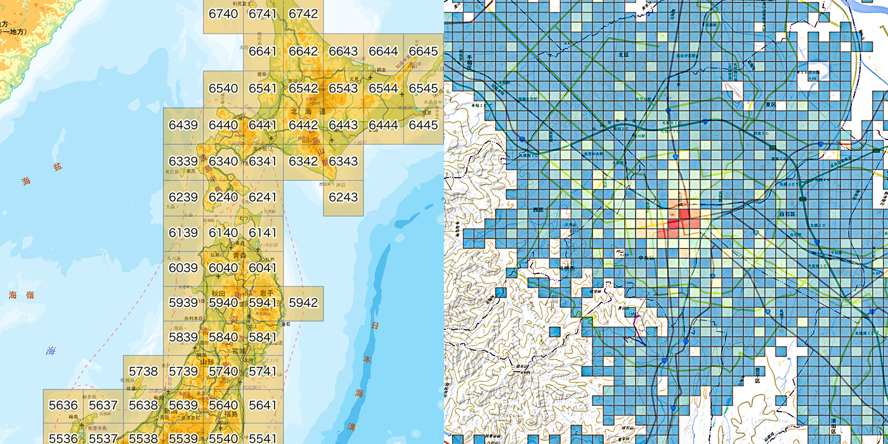

# qgis-japan-mesh

<p><p>

[](https://github.com/MIERUNE/qgis-japan-mesh/actions/workflows/test.yml)

A QGIS Plugin to handle common Japanese grid squares — 日本で使われている「標準地域メッシュ」と「国土基本図図郭」を QGIS で扱うためのプラグインです。



主な機能：

- 「標準地域メッシュ」の生成
- 「国土基本図図郭」の生成
- 「e-Stat 地域メッシュ統計（国勢調査・経済センサス等）」の読み込み
- 地図上のマウスカーソル位置のメッシュコードをリアルタイムに表示するパネル機能

プロセッシングツールボックスに追加される「地域メッシュ」メニュー、またはツールバー上のアイコンから呼び出して利用できます。

機能の要望や問題点の報告を歓迎いたします。GitHub の Issue にどうぞ。

## Installation (インストール)

本プラグインは QGIS Python Plugin Repository で公開されており、QGIS の「プラグインの管理とインストール」から &#8220;[Japanese Grid Mesh](https://plugins.qgis.org/plugins/japanese_grids/)&#8221; で検索してインストールできます。

主にプロセッシングプラグインとして機能します。プロセッシングツールボックスから呼び出して利用できます。

## License (ライセンス)

GPL v2

## Development

QGIS にデプロイする:

```console
make deploy
```

## Contributions

機能の要望や問題点の報告を歓迎いたします。GitHub の Issue にどうぞ。

### Authors

- Taku Fukada ([@ciscorn](https://github.com/ciscorn)) - Original Author
- And all contributors
